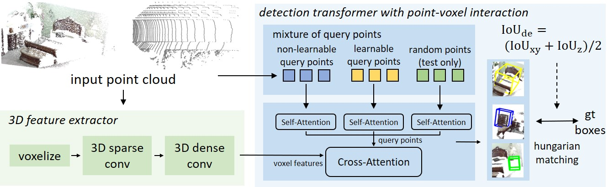
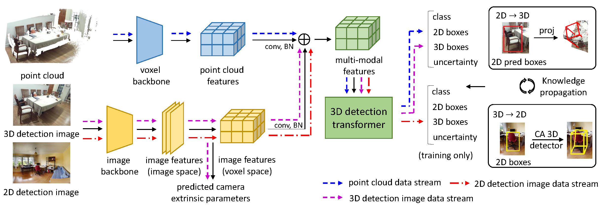

# Uni3DETR & OV-Uni3DETR

This includes code for:
our NeurIPS 2023 paper
[**Uni3DETR: Unified 3D Detection Transformer**](https://arxiv.org/pdf/2310.05699)

<div align="center">
  
</div><br/>

our ECCV 2024 paper
[**OV-Uni3DETR: Towards Unified Open-Vocabulary 3D Object Detection via Cycle-Modality Propagation**](https://arxiv.org/pdf/2403.19580)

<div align="center">
  
</div><br/>

Uni3DETR provides a unified structure for both indoor and outdoor 3D object detection.
Based on this architecture, OV-Uni3DETR further introduces multi-modal learning and open-vocabulary learning to achieve modality unifying and category unifying with a unified structure.

## Preparation
This project is based on [mmDetection3D](https://github.com/open-mmlab/mmdetection3d), which can be constructed as follows.
* Install mmDetection3D [v1.0.0rc5](https://github.com/open-mmlab/mmdetection3d/tree/v1.0.0rc5) following [the instructions](https://github.com/open-mmlab/mmdetection3d/blob/v1.0.0rc5/docs/getting_started.md).
* Copy our project and related files to installed mmDetection3D:
```bash
cp -r projects mmdetection3d/
cp -r extra_tools mmdetection3d/
```
* Prepare the dataset following [mmDetection3D dataset instructions](https://github.com/open-mmlab/mmdetection3d/tree/v1.0.0rc5/docs/en/datasets).
* Uni3DETR dataset preparation:
  
SUN RGB-D dataset:
The directory structure after processing should be as follows:
```
sunrgbd
├── README.md
├── matlab
│   ├── ...
├── OFFICIAL_SUNRGBD
│   ├── ...
├── sunrgbd_trainval
│   ├── ...
├── points
├── sunrgbd_infos_train.pkl
├── sunrgbd_infos_val.pkl
```
ScanNet dataset:

After downloading datasets following mmDetection3D, run ``python scripts/scannet_globalallign.py`` to perform global alignment in advance. Please note that this operation will modify the data file. If you have any concerns, it is recommended to back up the file first.

The directory structure should be as below

```
scannet
├── meta_data
├── batch_load_scannet_data.py
├── load_scannet_data.py
├── scannet_utils.py
├── README.md
├── scans
├── scans_test
├── scannet_instance_data
├── points
│   ├── xxxxx.bin
├── instance_mask
│   ├── xxxxx.bin
├── semantic_mask
│   ├── xxxxx.bin
├── seg_info
│   ├── train_label_weight.npy
│   ├── train_resampled_scene_idxs.npy
│   ├── val_label_weight.npy
│   ├── val_resampled_scene_idxs.npy
├── posed_images
│   ├── scenexxxx_xx
│   │   ├── xxxxxx.txt
│   │   ├── xxxxxx.jpg
│   │   ├── intrinsic.txt
├── scannet_infos_train.pkl
├── scannet_infos_val.pkl
├── scannet_infos_test.pkl
```

The outdoor KITTI and nuScenes datasets preparation steps are totally the same as mmDetection3D.

* OV-Uni3DETR dataset preparation:

SUN RGB-D dataset:

The SUN RGB-D dataset preparation steps are the same as the Uni3DETR steps above, the only difference is the annotation file. The annotations file can be downloaded directly from [GoogleDrive](https://drive.google.com/drive/folders/1ljh6quUw5gLyHbQiY68HDGtY6QLp_d6e?usp=sharing). We will upload codes about how to generate the annotation files for training soon.


## Training
```bash
bash extra_tools/dist_train.sh ${CFG_FILE} ${NUM_GPUS}
```

## Evaluation
```bash
bash extra_tools/dist_test.sh ${CFG_FILE} ${CKPT} ${NUM_GPUS} --eval=bbox
```

## Uni3DETR models
We provide results on SUN RGB-D, ScanNet, KITTI, nuScenes with pretrained models (for Tab. 1, Tab. 2, Tab. 3 of our paper).
|  Dataset                                    | mAP (%) | download | 
|---------------------------------------------|:-------:|:-------:|
| **indoor** |
| [SUN RGB-D](projects/configs/uni3detr/uni3detr_sunrgbd.py) | 67.0 | [GoogleDrive](https://drive.google.com/drive/folders/1ljh6quUw5gLyHbQiY68HDGtY6QLp_d6e?usp=sharing) |
| [ScanNet](projects/configs/uni3detr/uni3detr_scannet_large.py) | 71.7 | [GoogleDrive](https://drive.google.com/drive/folders/1ljh6quUw5gLyHbQiY68HDGtY6QLp_d6e?usp=sharing) |
| **outdoor** |
| [KITTI (3 classes)](projects/configs/uni3detr/uni3detr_kitti_car.py) | 86.57 (moderate car) | [GoogleDrive](https://drive.google.com/drive/folders/1ljh6quUw5gLyHbQiY68HDGtY6QLp_d6e?usp=sharing) |
| [KITTI (car)](projects/configs/uni3detr/uni3detr_kitti_3classes.py) | 86.74 (moderate car) | [GoogleDrive](https://drive.google.com/drive/folders/1ljh6quUw5gLyHbQiY68HDGtY6QLp_d6e?usp=sharing) |
| [nuScenes](projects/configs/uni3detr/uni3detr_nuscenes.py) | 61.7 | [GoogleDrive](https://drive.google.com/drive/folders/1ljh6quUw5gLyHbQiY68HDGtY6QLp_d6e?usp=sharing) |

